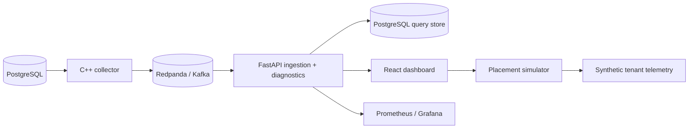

# PlanTrace

PlanTrace is a local database systems project focused on PostgreSQL query telemetry, EXPLAIN ANALYZE diagnostics, optimizer regression detection, and a synthetic multi-tenant SQL placement simulator.

GitHub About / description: `SQL Query Diagnostics & Workload Optimization Platform`

It is intentionally honest in scope:

- PostgreSQL query telemetry and plan capture are real
- Optimizer regression detection is deterministic
- Placement is a simulated what-if engine over synthetic tenant telemetry
- It is not a production Azure SQL deployment and does not claim to manage live cloud clusters
- The backend still uses the internal `querylens` schema and `querylens_*` metrics for compatibility; the public project name is PlanTrace

## Architecture



## What it does

- Fingerprints normalized SQL so semantically identical statements collapse to one hash
- Captures query metrics and EXPLAIN JSON / EXPLAIN ANALYZE evidence
- Detects deterministic optimizer regressions:
  - row-estimate mismatch
  - sequential-scan fallback
  - missing index candidates
  - temp / sort / hash spill
  - nested-loop explosion
  - pgvector / HNSW bypass
- Stores query plans, regressions, and diagnostic findings in PostgreSQL
- Streams telemetry through Kafka / Redpanda with bounded retry and DLQ handling
- Simulates multi-tenant placement strategies:
  - first-fit baseline
  - greedy best-fit
  - weighted scoring
  - local-search rebalancer

## Layout

- `backend/` FastAPI service, collector, diagnostics, placement simulator, migrations, and tests
- `collector/` C++ telemetry collector
- `frontend/` React dashboard
- `docs/` architecture, demo, operations, regression rules, and benchmark notes
- `scripts/` benchmark and evaluation helpers
- `infra/` Postgres init SQL and Prometheus config

## Quick Start

```bash
make setup
make build
make up
make migrate
make seed
make test
make demo
```

## Core Screens

- Dashboard: query latency, regressions, collector status
- Query detail: fingerprint, plan tree, recommendations, diagnostics, and report generation
- Regressions: deterministic regression feed
- Placement simulator: synthetic tenant telemetry and before/after placement comparison

Screenshots live under [docs/screenshots](docs/screenshots/).

## API Examples

```bash
curl http://localhost:8765/health
curl http://localhost:8765/api/queries
curl http://localhost:8765/api/queries/<fingerprint-id>/diagnostics
curl -X POST http://localhost:8765/api/placement/simulate \
  -H 'content-type: application/json' \
  -d '{"seed":42,"tenants":48,"regions":3,"clusters_per_region":2,"nodes_per_cluster":3}'
```

## Benchmark Methodology

The benchmark workflow is documented in [docs/BENCHMARKS.md](docs/BENCHMARKS.md).

In short:

- telemetry benchmark events are produced into Kafka
- the backend consumer measures ingest latency, lag, duplicates, and DLQ counts
- regression detection uses deterministic seeded scenarios
- placement simulation is evaluated on synthetic tenant telemetry, not live customer clusters

## Testing

```bash
cd backend && .venv/bin/python -m pytest tests -v
cd backend && .venv/bin/ruff check app tests
cd frontend && npm run build
```

## Resume-Ready Summary

Built a database telemetry platform that streams PostgreSQL query events from a C++ collector through Kafka into FastAPI and React dashboards for query debugging, optimizer regression analysis, and synthetic placement simulation.

Implemented deterministic EXPLAIN ANALYZE diagnostics and query fingerprinting to detect row-estimate mismatch, sequential-scan fallbacks, temp spills, nested-loop explosions, and pgvector/HNSW bypass patterns.

Added a synthetic multi-tenant placement engine with first-fit, greedy best-fit, weighted scoring, and local-search strategies to compare overloaded-node counts, utilization balance, migration cost, hotspot reduction, and p95 placement latency.
